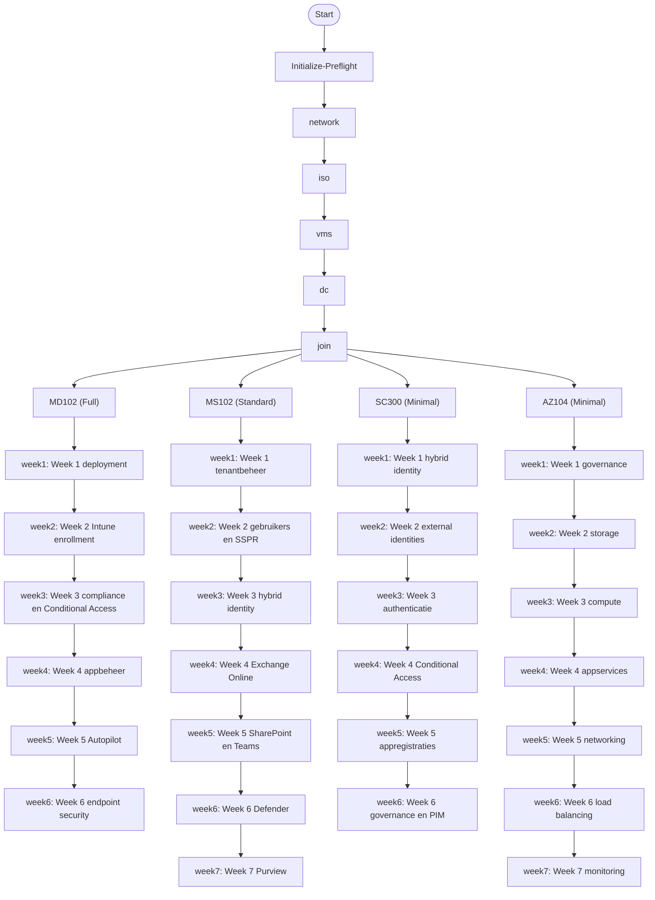

# Lab Dependency Graph

> Gegenereerd op 2026-03-29 20:27 +02:00. Dit document beschrijft de aanbevolen uitvoervolgorde van de SSW-Lab setupflow en de 26 labscripts per certificeringstraject.

## Overzicht

De setupflow is voor alle trajecten gelijk tot en met `Join-LabComputersToDomain.ps1`. Daarna vertakt het lab in het gekozen traject uit `profiles/learning-tracks.json`.



## Setupflow

| Stap | Script | Doel |
|------|--------|------|
| Initialize-Preflight | `scripts/Initialize-Preflight.ps1` | Controleert host, RAM, Hyper-V en trajectkeuze. |
| Configure-HostNetwork | `scripts/Configure-HostNetwork.ps1` | Maakt vSwitch, NAT en hostgateway aan. |
| Build-UnattendedIsos | `scripts/Build-UnattendedIsos.ps1` | Bouwt unattended ISO`s uit MSDN-bron-ISO`s. |
| New-LabVMs | `scripts/New-LabVMs.ps1` | Maakt de basis-VMs aan volgens het gekozen preset. |
| Initialize-DomainController | `scripts/Initialize-DomainController.ps1` | Promoveert de domain controller en richt basisservices in. |
| Join-LabComputersToDomain | `scripts/Join-LabComputersToDomain.ps1` | Joint de geselecteerde clients aan het labdomein. |

## Trajecten

### MD-102 Endpoint Administrator

- Aanbevolen preset: `Full`
- Focus: Windows deployment, Intune, compliance, apps en endpoint security

| Volgorde | Script | Samenvatting |
|----------|--------|--------------|
| Week 1 deployment | `scripts/labs/MD102/lab-week1-deployment.ps1` | Basisdeployment, Hyper-V en domeinjoin voorbereiden |
| Week 2 Intune enrollment | `scripts/labs/MD102/lab-week2-intune.ps1` | Intune-enrollment en hybrid join valideren |
| Week 3 compliance en Conditional Access | `scripts/labs/MD102/lab-week3-compliance-ca.ps1` | Compliance policies en Conditional Access oefenen |
| Week 4 appbeheer | `scripts/labs/MD102/lab-week4-apps.ps1` | Win32-app packaging en deployment testen |
| Week 5 Autopilot | `scripts/labs/MD102/lab-week5-autopilot.ps1` | Autopilot hardware hash en provisioning oefenen |
| Week 6 endpoint security | `scripts/labs/MD102/lab-week6-security.ps1` | Defender, EICAR en update rings valideren |

### MS-102 Microsoft 365 Administrator

- Aanbevolen preset: `Standard`
- Focus: Tenantbeheer, hybrid identity, Exchange, SharePoint, Teams en Defender

| Volgorde | Script | Samenvatting |
|----------|--------|--------------|
| Week 1 tenantbeheer | `scripts/labs/MS102/lab-week1-tenant.ps1` | Tenantbasis en syncflow controleren |
| Week 2 gebruikers en SSPR | `scripts/labs/MS102/lab-week2-gebruikers.ps1` | OU-structuur, bulkgebruikers en SSPR |
| Week 3 hybrid identity | `scripts/labs/MS102/lab-week3-hybrid-identity.ps1` | ADSync scheduler, writeback en MFA |
| Week 4 Exchange Online | `scripts/labs/MS102/lab-week4-exchange.ps1` | Exchange Online, shared mailbox en DKIM |
| Week 5 SharePoint en Teams | `scripts/labs/MS102/lab-week5-sharepoint-teams.ps1` | Samenwerking en extern delen configureren |
| Week 6 Defender | `scripts/labs/MS102/lab-week6-defender.ps1` | Defender XDR en Secure Score |
| Week 7 Purview | `scripts/labs/MS102/lab-week7-purview.ps1` | Purview, DLP en eDiscovery |

### SC-300 Identity and Access Administrator

- Aanbevolen preset: `Minimal`
- Focus: Entra ID, authentication methods, appregistraties en governance

| Volgorde | Script | Samenvatting |
|----------|--------|--------------|
| Week 1 hybrid identity | `scripts/labs/SC300/lab-week1-hybrid-identity.ps1` | AD-structuur en Entra Connect |
| Week 2 external identities | `scripts/labs/SC300/lab-week2-external-identities.ps1` | B2B en cross-tenant toegang |
| Week 3 authenticatie | `scripts/labs/SC300/lab-week3-authentication.ps1` | SSPR, FIDO2, WHfB en auth strengths |
| Week 4 Conditional Access | `scripts/labs/SC300/lab-week4-conditional-access.ps1` | CA-beleid, Named Locations en sign-in logs |
| Week 5 appregistraties | `scripts/labs/SC300/lab-week5-appregistrations.ps1` | Appregistraties, API-permissies en App Proxy |
| Week 6 governance en PIM | `scripts/labs/SC300/lab-week6-governance-pim.ps1` | Access packages, reviews en PIM |

### AZ-104 Azure Administrator

- Aanbevolen preset: `Minimal`
- Focus: Governance, storage, compute, networking en monitoring

| Volgorde | Script | Samenvatting |
|----------|--------|--------------|
| Week 1 governance | `scripts/labs/AZ104/lab-week1-governance.ps1` | Resource groups, RBAC en Policy |
| Week 2 storage | `scripts/labs/AZ104/lab-week2-storage.ps1` | Storage account, blob en file share |
| Week 3 compute | `scripts/labs/AZ104/lab-week3-compute.ps1` | Azure VM, disks, snapshot en backup |
| Week 4 appservices | `scripts/labs/AZ104/lab-week4-appservices.ps1` | App Service, slots, ACI en autoscale |
| Week 5 networking | `scripts/labs/AZ104/lab-week5-networking.ps1` | VNet, NSG, peering en private DNS |
| Week 6 load balancing | `scripts/labs/AZ104/lab-week6-loadbalancing.ps1` | Load Balancer, App Gateway en Traffic Manager |
| Week 7 monitoring | `scripts/labs/AZ104/lab-week7-monitoring.ps1` | Log Analytics, VM Insights en alerts |

## Gebruik

Werk dit document bij nadat `profiles/learning-tracks.json` verandert:

```powershell
.\scripts\utility\Export-LabDependencyGraph.ps1
```
